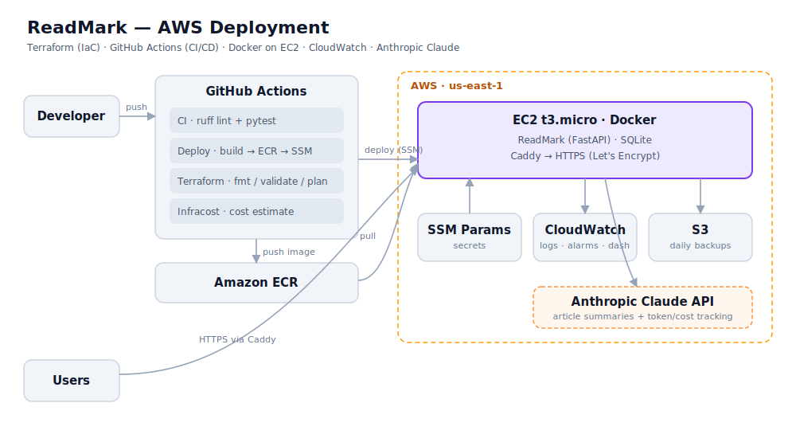

# ReadMark

**Save links, track your reading progress, and sync across devices.**

ReadMark is a self-hostable read-it-later app. Save any web page from your
browser, then pick up reading where you left off on any device — your scroll
position, reading status, and notes stay in sync through your own backend.

It has two parts, kept together in this monorepo:

| Part | What it is | Runs where |
| --- | --- | --- |
| **`extension/`** | A Chrome/Edge (Manifest V3) browser extension — the client you interact with | In your browser |
| **`backend/`** | A FastAPI server with a REST API + a small web dashboard | On your machine, a server, or Docker |

```
┌────────────────────┐        HTTPS/HTTP         ┌────────────────────┐
│  Browser Extension │ ───── /api/auth/* ──────▶ │   FastAPI Backend  │
│  (popup + content  │ ───── /api/items/* ─────▶ │   + SQLite + JWT   │
│   scripts)         │ ◀──── saved items ─────── │   + web dashboard  │
└────────────────────┘                           └────────────────────┘
```

---

## Features

- 🔖 **Save any page** for later, straight from the browser toolbar.
- 📈 **Reading-progress tracking** — remembers your scroll position (0–100%) per article.
- 🗂️ **Organize** by status (`unread` / `reading` / `done`), category, and notes.
- 🔍 **Search & sort** your saved items.
- ☁️ **Cross-device sync** through your own backend — your data never leaves servers you control.
- 👤 **Accounts** with email + password (JWT auth), and optional Google sign-in.
- 🖥️ **Built-in web dashboard** served by the backend at `/`, with an in-app reader.

---

## Repository structure

```
readmark/
├── extension/               # Manifest V3 browser extension (the client)
│   ├── manifest.json        #   extension manifest
│   ├── background.js        #   service worker (API proxy, alarms)
│   ├── content.js           #   content script (scroll tracking on pages)
│   ├── popup.html/.js        #   toolbar popup UI
│   ├── api.js               #   API client — set API_BASE_URL here
│   └── icons/               #   toolbar icons
│
├── backend/                 # FastAPI server (the API + dashboard)
│   ├── main.py              #   app entry, CORS, dashboard, /metrics, health
│   ├── config.py            #   settings (loaded from env / .env)
│   ├── database.py          #   async SQLAlchemy engine + migrations
│   ├── models.py            #   User, ReadingItem, AIUsage tables
│   ├── ai.py                #   Claude summarization + cost estimation
│   ├── observability.py     #   JSON logging + Prometheus metrics
│   ├── auth.py              #   JWT, bcrypt hashing, Google token verification
│   ├── routes/              #   auth_routes, items_routes, ai_routes
│   ├── static/              #   web dashboard (index.html, reader, PWA files)
│   ├── test_readmark.py     #   integration test suite
│   ├── Dockerfile           #   multi-stage, non-root, healthcheck
│   └── docker-compose.yml   #   one-command container deploy
│
├── infra/                   # Terraform — AWS deployment (EC2 + Docker)
├── .github/workflows/       # CI (lint/test), Deploy (ECR→SSM), Terraform, Infracost
├── scripts/                 # smoke-test.sh, aws-cost-report.sh
└── docs/                    # architecture, runbooks, ADRs
```

---

## Quickstart

### 1. Run the backend

**Requirements:** Python 3.11+ (tested on 3.12–3.13). SQLite is built in — no database to install.

```bash
git clone https://github.com/Iddrisu08/readmark.git
cd readmark/backend

python -m venv .venv
source .venv/bin/activate          # Windows: .venv\Scripts\activate
pip install -r requirements.txt

# Optional but recommended — set your own secret key & config:
cp .env.example .env                # then edit .env (see Configuration below)

uvicorn main:app --host 0.0.0.0 --port 8000
```

The database tables are created automatically on first start. You should see:

```
✦ ReadMark v1.0.0 ready
```

Verify it:

```bash
curl http://localhost:8000/api/health
# {"status":"ok","app":"ReadMark","version":"1.0.0"}
```

Open the dashboard at **http://localhost:8000/** and the interactive API docs at
**http://localhost:8000/docs**.

> **Note:** the app runs with sensible defaults even without a `.env`, but it will
> use an insecure default `SECRET_KEY`. **Always set your own `SECRET_KEY` for
> anything beyond local testing** (see Configuration).

### 2. Load the extension

1. Open `chrome://extensions` (or `edge://extensions`).
2. Turn on **Developer mode**.
3. Click **Load unpacked** and select the `extension/` folder.
4. By default the extension talks to `http://localhost:8000`. To point it at a
   different server, edit `API_BASE_URL` at the top of `extension/api.js`.
5. Click the ReadMark toolbar icon, create an account, and start saving pages.

---

## Configuration

The backend reads configuration from environment variables (or a `.env` file in
`backend/`). Copy `.env.example` to `.env` and adjust:

| Variable | Default | Description |
| --- | --- | --- |
| `SECRET_KEY` | `change-me-...` | **Set this.** Signs JWT tokens. Generate with `python -c "import secrets; print(secrets.token_hex(32))"` |
| `DATABASE_URL` | `sqlite+aiosqlite:///./readmark.db` | Any SQLAlchemy async URL. SQLite needs no setup. |
| `ALLOWED_ORIGINS` | `*` | Comma-separated CORS origins. Restrict this in production. |
| `ACCESS_TOKEN_EXPIRE_MINUTES` | `10080` (7 days) | JWT lifetime. |
| `GOOGLE_CLIENT_ID` | *(empty)* | Optional — enables Google sign-in. |
| `GOOGLE_CLIENT_SECRET` | *(empty)* | Optional — for Google OAuth. |
| `DEBUG` | `false` | Enables SQL echo and verbose errors. |

Secrets (`.env`) and the database (`*.db`) are gitignored and never committed.

---

## API reference

All endpoints are under `/api`. Authenticated routes need an
`Authorization: Bearer <token>` header (obtained from register/login).

### Auth

| Method | Path | Description |
| --- | --- | --- |
| `POST` | `/api/auth/register` | Create an account (email + password) → returns JWT |
| `POST` | `/api/auth/login` | Log in → returns JWT |
| `POST` | `/api/auth/google` | Log in with a Google ID token |
| `GET` | `/api/auth/me` | Current user profile |

### Items

| Method | Path | Description |
| --- | --- | --- |
| `GET` | `/api/items` | List items (filter by `status`, `category`, `search`, `sort`) |
| `POST` | `/api/items` | Save a new item |
| `GET` | `/api/items/{id}` | Get a single item |
| `PATCH` | `/api/items/{id}` | Update status, notes, scroll position, etc. |
| `DELETE` | `/api/items/{id}` | Delete an item |
| `POST` | `/api/items/scroll` | Update scroll position by URL |
| `GET` | `/api/items/lookup/url` | Find a saved item by its URL |
| `POST` | `/api/items/sync` | Bulk-sync items from the client |

### AI (Claude)

| Method | Path | Description |
| --- | --- | --- |
| `POST` | `/api/ai/summarize` | Summarize a saved item, URL, or text → summary + token/cost usage |
| `GET` | `/api/ai/usage` | Aggregated AI usage & estimated spend for the user (FinOps) |

### Ops & Misc

| Method | Path | Description |
| --- | --- | --- |
| `GET` | `/api/health` | Liveness check |
| `GET` | `/api/ready` | Readiness check (database reachable) |
| `GET` | `/metrics` | Prometheus metrics (HTTP + AI usage/cost) |
| `GET` | `/api/proxy` | Server-side article fetch for the in-app reader (authed) |
| `GET` | `/` | Web dashboard |
| `GET` | `/docs` | Interactive OpenAPI docs |

---

## Data model

**User** — `id`, `email`, `password_hash` (null for OAuth users), `name`,
`avatar_url`, `auth_provider` (`email`/`google`), `google_id`, timestamps.

**ReadingItem** — `id`, `user_id`, `url`, `normalized_url`, `title`, `category`,
`notes`, `status` (`unread`/`reading`/`done`), `scroll_position` (0–100),
`estimated_read_time`, `favicon`, timestamps.

---

## Deploy with Docker

From `backend/`:

```bash
docker compose up --build
```

This builds the image, runs the API on port `8000`, and persists the SQLite
database in the `readmark-data` volume (`/data/readmark.db`). A `.env` is
optional — if present it overrides the defaults, otherwise built-in defaults are
used. **Set `SECRET_KEY` via `.env` before exposing it publicly.**

---

## Production notes

- **Use HTTPS.** JWTs and passwords are sent in the request; put the API behind a
  TLS-terminating reverse proxy (Caddy, nginx, Traefik) or a managed platform.
- **Set a strong `SECRET_KEY`** and restrict `ALLOWED_ORIGINS` to your real origins.
- **Back up the database** (`readmark.db` or your `DATABASE_URL` target).
- For heavier use, point `DATABASE_URL` at Postgres
  (`postgresql+asyncpg://...`) instead of SQLite.

---

## Cloud deployment & DevOps (AWS)

Beyond the single-server Docker setup above, ReadMark ships with a full
**Infrastructure-as-Code** deployment to AWS and an automated delivery pipeline.



*A push to `main` runs CI, builds the image to ECR, and deploys to EC2 via SSM.
Everything in the AWS box is provisioned by Terraform (`infra/`).*

| Capability | How |
| --- | --- |
| **Infrastructure as Code** | `infra/` — Terraform (EC2, ECR, IAM, SSM, S3, CloudWatch) |
| **CI/CD** | GitHub Actions — lint/test, build→ECR→SSM deploy, Terraform plan |
| **Containers** | Multi-stage Docker image, non-root, healthcheck |
| **Secrets** | SSM Parameter Store (SecureString); never in git/AMI/image |
| **Observability** | Structured JSON logs + Prometheus `/metrics`; CloudWatch alarms |
| **AI integration** | Anthropic Claude summarization with per-call token/cost tracking |
| **FinOps** | Infracost in CI, ECR/S3 lifecycle policies, AI-spend metrics, cost report script |
| **Runbooks** | Incident response, deploy/rollback, backup/restore (`docs/runbooks/`) |

**Deploy it:**

```bash
cd infra
cp terraform.tfvars.example terraform.tfvars   # set app_secret_key (+ anthropic_api_key)
terraform init && terraform apply
```

See **[`docs/architecture.md`](docs/architecture.md)** for the full picture and
**[`docs/runbooks/`](docs/runbooks/)** for operational procedures.

---

## Development & testing

An integration test suite lives in `backend/test_readmark.py`:

```bash
cd backend
pip install requests pytest
# Test against a running server (defaults to http://localhost:8000):
READMARK_TEST_URL=http://localhost:8000/api pytest test_readmark.py -v
```

---

## Tech stack

- **Backend:** FastAPI, SQLAlchemy 2 (async) + aiosqlite, Pydantic v2, python-jose (JWT), passlib/bcrypt, httpx.
- **Extension:** vanilla JavaScript, Chrome Manifest V3 (service worker + content scripts).
- **Storage:** SQLite by default (any async SQLAlchemy database supported).
